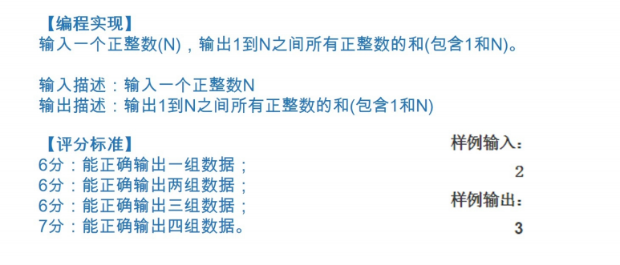
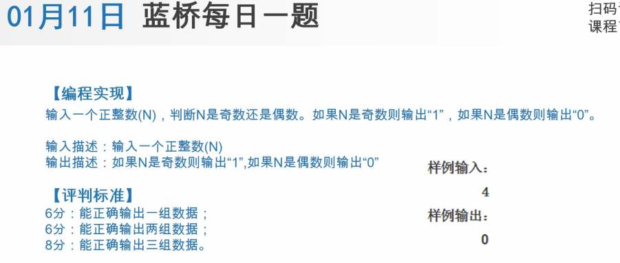
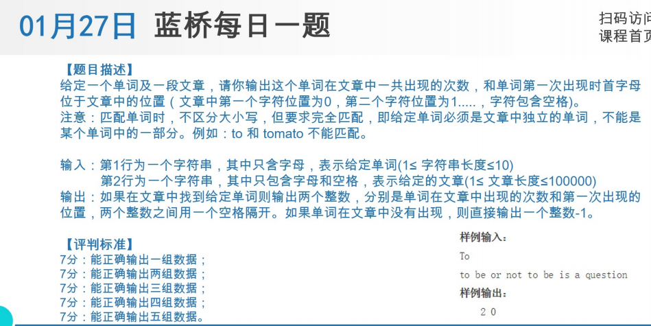

-----
# 1. 画太阳-七月份-11.7月11日-Python绘图-621


**答案**
```py
import turtle
t = turtle.Pen()
t.pencolor("yellow")
t.right(60)
t.fillcolor("yellow")
t.begin_fill()
for i in range(12):
    t.forward(50)
    t.left(120)
    t.forward(50)
    t.right(90)
t.end_fill()
t.left(60)

t.pencolor("red")
t.fillcolor("red")
t.begin_fill()
for i in range(12):
    t.forward(50)
    t.left(30)
t.end_fill()

turtle.done()


```
-----

# 2. 一月份-19.1月19日-Python求和




答案

>```py
>a = int(input())
>sum = 0
>for x in range(1,a+1):
>    sum = sum + x
>print(sum)
>
>```
>


-----

# 3. 一月份-11.1月11日-Python奇偶数




答案

>```py
>a = int(input())
>if a%2 ==0:     #除以2，偶数余数是0
>    print("0")
>else:
>    print("1")
>
>```
>

-----
# 4. 一月份-27.1月27日-Python单词频次




答案

>```py
>
>a = input()
>b = input()
>
># a = 'To'
># b = 'to be or not to be is a question'
>a = a.upper()                  # 统一成 大写字母的单词
>b = b.upper()
># print(a.upper()) #
># print(b.upper())
>b2 = b.split(" ")
>b3 = b2.copy()
># print(b2)
>cs = 0
>for x in range(len(b3)):
>    if a in b3:                # 如果 a 在列表b3 成立。
>        cs  = cs +1            # 出现次数 +1
>        b3.remove(a)
># print("次数",cs)
># print("第1次出现位置",b2.index(a))
>
>if cs ==0:
>    print("-1")
>else:
>    print("{} {}".format(cs,b2.index(a)))
>
>
>
>
>
>
>```
>

-----

-----
-----
-----
-----
-----
-----
-----
-----
-----
-----
-----
-----
-----
-----
-----
-----
-----
-----
-----
-----
-----
-----
-----
-----
