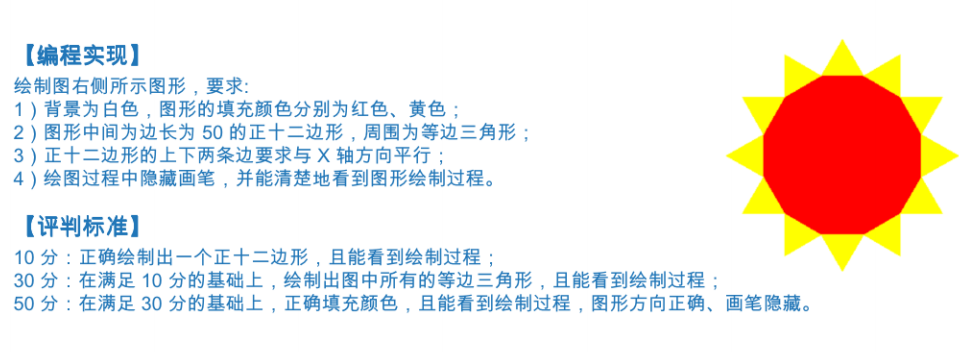

-----
# 1. 画太阳-七月份-11.7月11日-Python绘图-621



**答案**
```py
import turtle
t = turtle.Pen()
t.pencolor("yellow")
t.right(60)
t.fillcolor("yellow")
t.begin_fill()
for i in range(12):
    t.forward(50)
    t.left(120)
    t.forward(50)
    t.right(90)
t.end_fill()
t.left(60)

t.pencolor("red")
t.fillcolor("red")
t.begin_fill()
for i in range(12):
    t.forward(50)
    t.left(30)
t.end_fill()

turtle.done()


```
-----

-----
